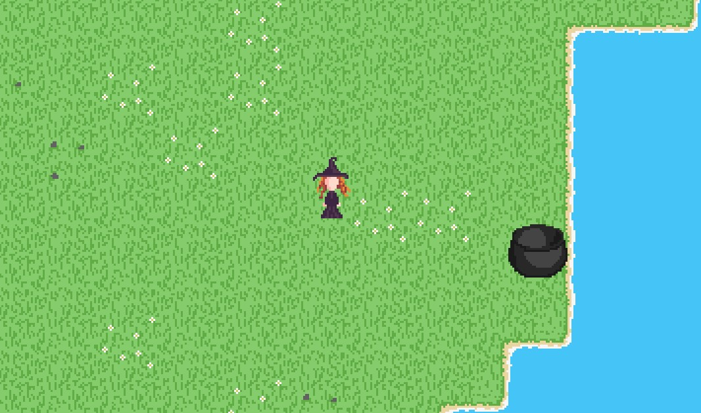

# Godot discovering project

2D tile based project made during the Ludum Dare 46 to test the some features of Godot Mono Engine.

- World generated procedurally, on the fly, to test C# integration
- 2D world using Godot Tilemap
- Movable animated 2D character using a spritesheet
- Audio ambiance which adapts to the player's position
- Animated water using a shader
- UI test for world generator settings (hit F1 to display it)
- Test of the localization system

## Controls

- Move the player with zqsd, arrows or gamepad.
- F1 to open debug menu.
- Page up/down or mouse wheel to zoom in/out.

